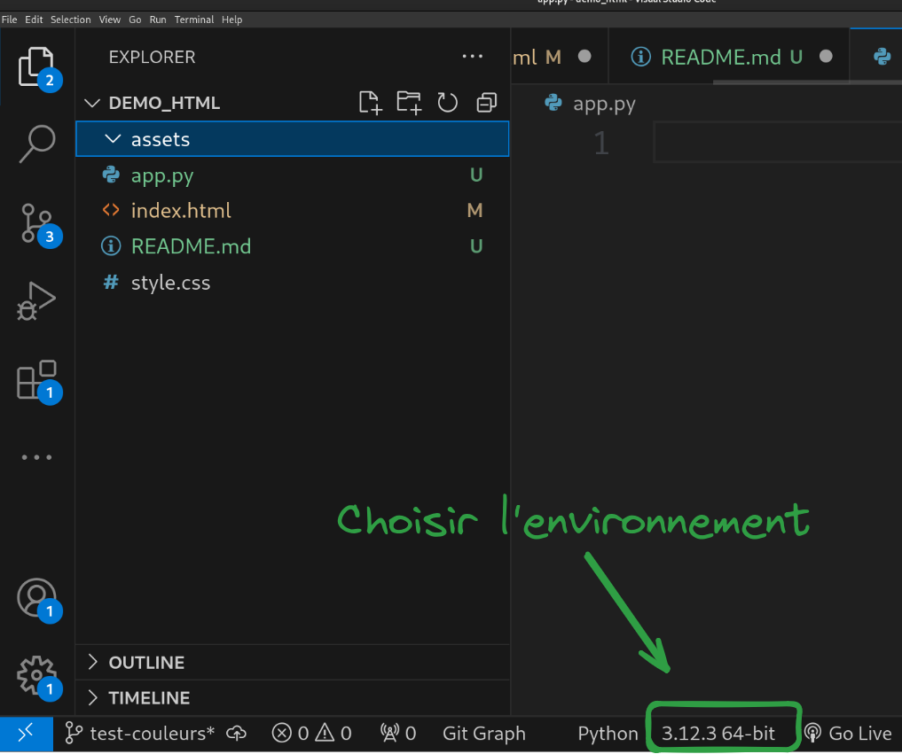
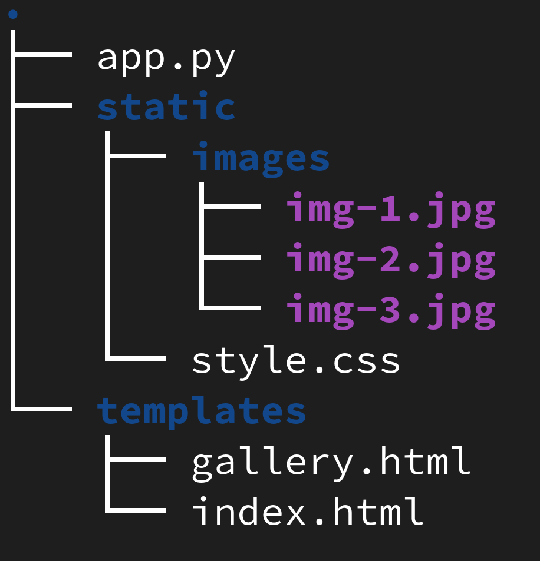

# Mise en place du projet

1. Overture de VS Code au BON endroit ;)
    - `file > open folder`

2. Création des pages HTML et CSS

3. Initialisation du repo GIT et GITHUB
    - penser à vérifier que vous utilisez ssh et pas https 

3. Création de l'environnement virtuel (avec conda)
    - conda `create --name ollama-flask`
    - on active l'environnement (dans le terminal, ET dans VS Code)
     
    
     
    - installation de Flask **dans** ollama-flask

5. Création du serveur Flask
    - suivre les tutoriels du cours
    - Pour lancer le serveur : 
        - option 1 : `flask --app <name_of_flask_app> run`
        - option 2 : `python <name_of_flask_app>.py`

    - Structure simplifiée d'un projet Flask :  
    Les noms `static` et `templates` sont obligatoires.  
    

    

6. Ouvrir le navigateur pour trouver le serveur :
    - `127.0.0.1:5000`
    - `localhost:5000`

7. Exporter votre environnement 
    - `conda export > environment.yml`
    - cela permettra à tout le monde de reconstruire l'environnement de travail. 

# Récupérer un projet Flask existant depuis GITHUB 

1. `git clone <url_du_projet>`
2. `cd` dans le projet.
3. Créer l'environnement virtuel : `conda env create -f environment.yml`
4. Activer l'environnement : `conda activate <env_name>`
5. Run : `python <name_of_flask_app>.py`
